# diagrams.net Dark Mode in SVG with CSS

## CSS prefers-color-scheme Media Feature

To support dark mode in SVG, add the following CSS to the SVG defs section:

```css
<style type="text/css">
@media (prefers-color-scheme: dark)
{
    svg {
        filter: invert(93%) hue-rotate(180deg);
        background-color: transparent !important;
    }
    image {
        filter: invert(100%) hue-rotate(180deg) saturate(1.25);
    }
}
</style>
```

This will change the SVG according to the current *system* setting. The light and
dark color variables in the CSS can be changed to reflect the containing page
(the above example is optimized for GitHub dark theme).

<a href="https://raw.githubusercontent.com/jgraph/drawio-github/master/diagram-light-dark.svg" target="_blank">Here</a> is an example that will render in dark mode in GitHub markdown depending on your system setting:



## CSS Target Pseudo-Class

If you need more control over dark mode in SVG images, the target CSS pseudo-class can be
used as follows. This will enable dark mode if the image is loaded with a #dark hash
property - or any other value that you assign to the SVG ID attribute. The media query
must be removed and :target must be added, resulting in the following CSS:

```css
<style type="text/css">
svg:target {
    filter: invert(93%) hue-rotate(180deg);
}
svg:target[style^="background-color: rgb(255, 255, 255);"] {
    background-color: transparent !important;
}
:target image {
    filter: invert(100%) hue-rotate(180deg) saturate(1.25);
}
</style>
```

Dark mode can now be enabled by adding #dark to the image source:


To disable dark mode, remove #dark from the image source:


In the following example, #dark is appended to the src attribute of
all images matching *.drawio.svg if the page background is not white:

```js
getComputedStyle(document.body).backgroundColor != 'rgba(0, 0, 0, 0)' ?
	document.querySelectorAll('img[src$=".drawio.svg"]').forEach(
		img => img.src += '#dark') : 0;
```
